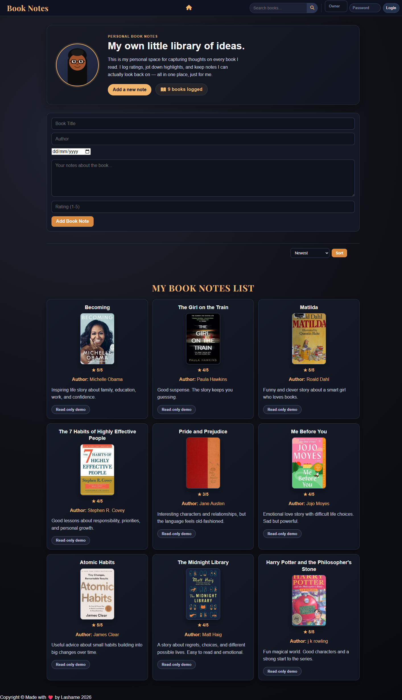

# Book Notes

Book Notes is a full-stack personal library application built with Node.js, Express, EJS, PostgreSQL, and Axios. It lets users save books they have read, write notes, track ratings and reading dates, fetch cover images from Open Library, and browse entries with search and sorting.

This project was built to demonstrate practical full-stack skills: API integration, server-side rendering, PostgreSQL persistence, CRUD operations, validation, and polished UI work, including session-based authentication.

**LIVE URL :** [bbook-notes-production-1684.up.railway.app](https://book-notes-production-1684.up.railway.app/)

## What It Does

- Creates, reads, updates, and deletes book notes stored in PostgreSQL
- Fetches book cover data from the Open Library API
- Supports search by title, author, or notes
- Supports sorting by recency, rating, and title
- Includes inline editing directly on the main page
- Includes owner-only login so edit and delete actions are hidden from public visitors
- Supports a safer public portfolio demo while keeping content management private

## Tech Stack

- Node.js
- Express.js
- PostgreSQL
- EJS
- Axios
- express-session
- CSS

## Highlights

- Integrated a third-party API into a server-rendered application flow
- Designed a PostgreSQL schema for persistent book-note storage
- Built same-page edit functionality with EJS and Express routes
- Added server-side validation for user input before database writes
- Added session-based owner authentication for protected note management
- Added a public-safe portfolio mode where visitors can browse but only the owner can manage content

## Project Structure

- `index.js`: Express server, routes, validation, PostgreSQL queries, API requests
- `views/`: EJS templates and shared partials
- `public/`: CSS and static assets
- `queries.sql`: database schema
- `README.md`: setup and project overview

## Environment Variables

Create a `.env` file in the project root:

```env
DB_USER=your_postgres_username
DB_HOST=localhost
DB_NAME=your_database_name
DB_PASSWORD=your_postgres_password
DB_PORT=5432
DEMO_READ_ONLY=false
OWNER_USERNAME=owner
OWNER_PASSWORD=your_owner_password
SESSION_SECRET=your_session_secret
```

Environment notes:

- `DEMO_READ_ONLY=true` disables public write access.
- `OWNER_USERNAME` and `OWNER_PASSWORD` are used for the owner login form.
- `SESSION_SECRET` protects the login session.
- In demo mode, visitors can browse the app, while the logged-in owner can still access management actions.

## Database Setup

Create a PostgreSQL database and run the SQL from [queries.sql](<c:/Users/lasha/OneDrive/Documents/Web%20development/Backend%20(learning%20course)/Capstone%20project%20(Book%20note)/queries.sql>).

Schema:

```sql
CREATE TABLE books (
  id SERIAL PRIMARY KEY,
  title TEXT NOT NULL,
  notes TEXT,
  rating INTEGER CHECK (rating >= 1 AND rating <= 5),
  date_read DATE,
  author TEXT,
  cover_id TEXT,
  cover_url TEXT
);
```

## Local Setup

Install dependencies:

```bash
npm install
```

Start the app:

```bash
npm start
```

Then open:

```text
http://localhost:3000
```

## Development Workflow

If you want auto-reload during development:

```bash
npm install --save-dev nodemon
npx nodemon index.js
```

## Screenshots

**Hero Section & Navbar**

The clean dark interface with persistent navigation. Search and owner login controls are in the top right; the avatar and call-to-action are center-featured.

**Book Notes Grid**

A responsive card layout showing book covers from Open Library, ratings, author, and notes. Each card displays a "Read-only demo" badge for public visitors (no edit/delete access).

## Deployment & Portfolio Setup

For a live portfolio demo, follow these steps:

1. **Choose a hosting platform** (Vercel, Railway, Render, Heroku, AWS, etc.)
2. **Create a hosted PostgreSQL database** (e.g., Render, AWS RDS, or similar)
3. **Deploy the app** with environment variables:
   - Database credentials (DB_USER, DB_HOST, DB_NAME, DB_PASSWORD, DB_PORT)
   - Owner credentials (OWNER_USERNAME, OWNER_PASSWORD)
   - Session secret (SESSION_SECRET)
   - Set `DEMO_READ_ONLY=true` so visitors can browse but only you can edit
4. **Add your live URL** to this README under a "Live Demo" section
5. **Pin to GitHub** for easy discovery

The public will see your book library, search functionality, and sorting. Only you (with the owner login) can add, edit, or delete entries.

## Implementation Notes

- Open Library is queried on book creation to find a matching cover image
- If no cover is returned, the book note is still saved successfully
- Validation is handled on the server for title, author, notes, date, and rating
- Search and sorting are handled from the main route and reflected in the UI through EJS templates
- Edit and delete routes are protected so only the logged-in owner can manage notes
- Owner authentication is intentionally lightweight because this project is positioned as a portfolio demo rather than a multi-user production product

## Future Improvements

- authentication for a private owner dashboard
- inline validation messages rendered in the UI
- automated tests for validation and route behavior
- deployment with HTTPS and environment-specific config
- a stronger authentication model for production use
